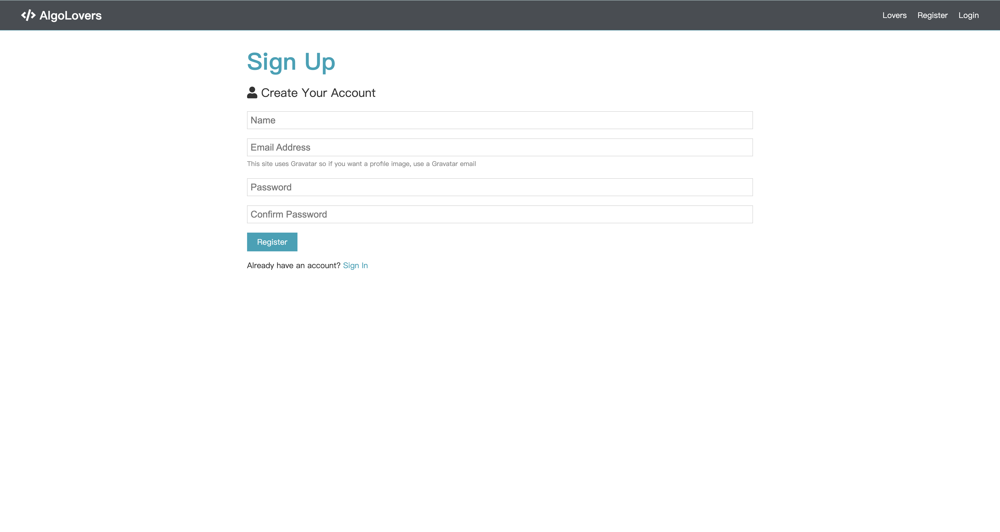
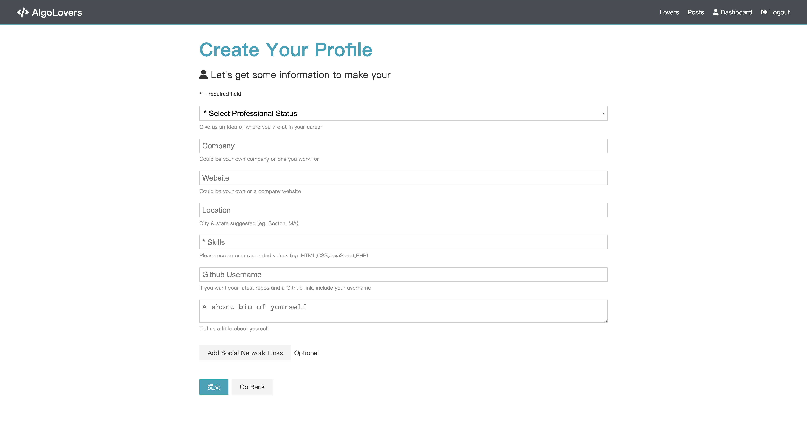
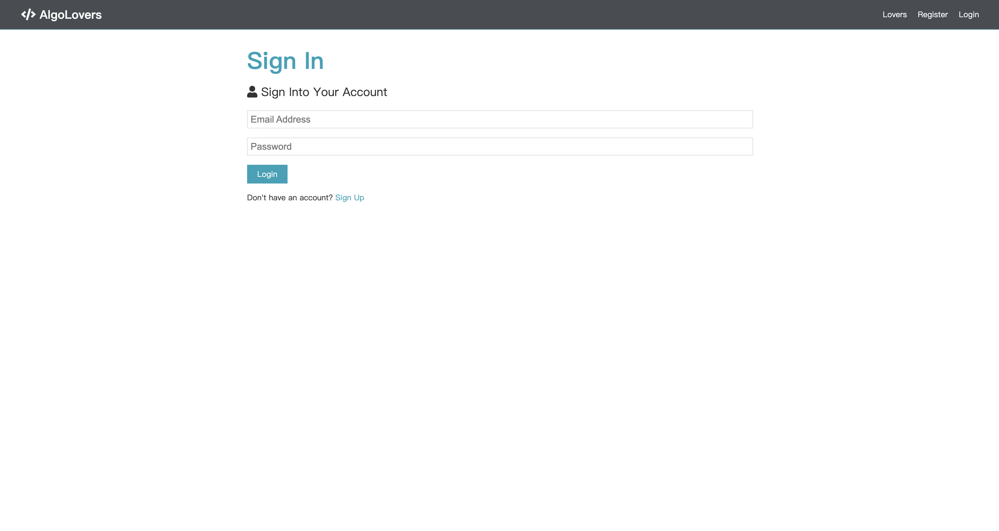
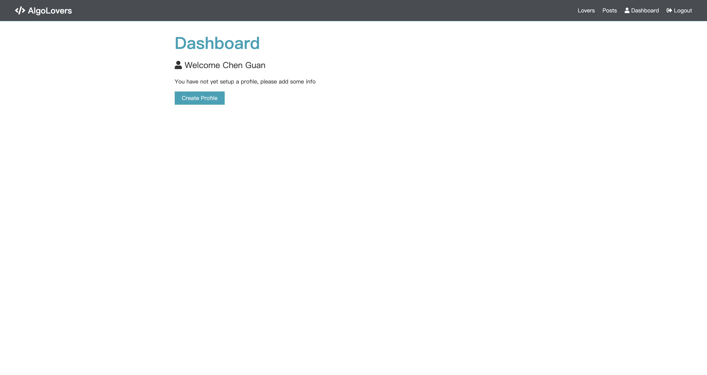
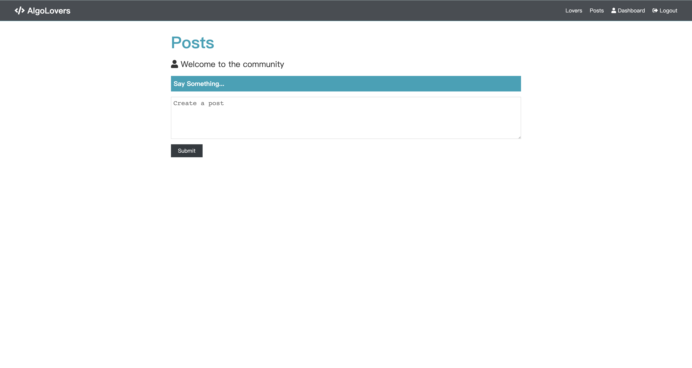
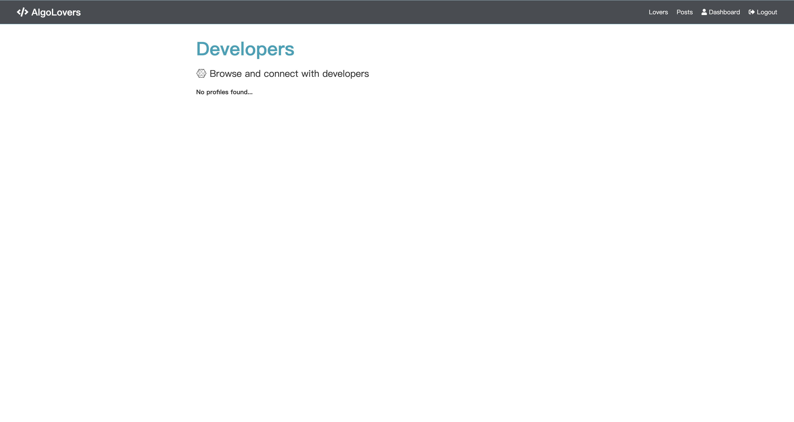

# Algorithm Lovers
A web platform to share and discuss algorithms.

[](https://github.com/nehCG/algorithm-lovers/blob/main/LICENSE)
[](https://github.com/nehCG/algorithm-lovers/actions?query=workflow%3A%22Build+Status%22)
[](https://codecov.io/gh/nehCG/algorithm-lovers)
[](https://www.npmjs.com/package/algorithm-lovers)
[](https://nehcg.github.io/algorithm-lovers/)

## Overview
Studying computer science invariably involves delving into algorithms. When I initially encountered concepts like greedy, divide and conquer, and dynamic programming, I found them challenging. However, I gradually developed a fascination for them. This interest grew particularly when I began incorporating these algorithms into my own projects, where the synergy between theory and practice fueled my enthusiasm.

Now, as a participant in competitive programming, I have developed novel algorithms in response to unique problems encountered during contests. Consequently, I have decided to build a web platform with two main objectives:

1. To share the algorithms I've developed, aiming to reach others with a passion for algorithms.
2. To establish a community for discussions about algorithms, encouraging the sharing of insights and opinions.

# Instruction to run the program

### Install Node.js

[Node.js](https://nodejs.org/en)

### Add a default.json file in config folder with the following

```json
{
  "mongoURI": "<your_mongoDB_Atlas_uri_with_credentials>",
  "jwtSecret": "secret"
}
```

### Install server dependencies

```bash
npm install
```

### Install client dependencies

```bash
cd client
npm install
```

### Run the web platform locally from root

```bash
npm run dev
```

# Examples of how to use the application

Examples of API usage can be found in the [static website](https://nehcg.github.io/algorithm-lovers/), which includes specific instructions for usage.

After you run the web platform locally, the web application will launch on your ```localhost:3000```. It is very similar to the usual social network, with features such as registration, login, browsing, posting, etc.

**Home Page**: Application home page that allows users to register, log in, or browse published content by clicking the relevant button in the upper right conrner.


**Sign Up Page**: The user registration page, where users can create a new account.



**Create Profile Page**: The profile creation page, where users can input and update their personal information, education, and work experience.



**Sign In Page**: The login page, where users can enter their credentials to access their account.



**Dashboard Page**: The main dashboard, where users can view an overview of their profile, posts, and other relevant information.



**Post Page**: A single post page, users can create a post here.



**Published content Page**: A page showing a list of all posts in the application, allowing users to browse and interact with them.




##  Functionalites and APIs

### CREATE
- ```api/auth```: Register a new user or authenticate an existing user.
- ```api/posts```: Create a new post.
- ```api/posts/comment/:id```: Add a comment to a post.
- ```api/profile```: Create a user profile.
- ```api/users```: Register a new user.

### READ
- ```api/auth```: Authenticate a user and return their information.
- ```api/profile/me```: Retrieve the current user's profile.
- ```api/posts```: Retrieve a single post by its ID.
- ```api/posts/:id```: Retrieve a single post by its ID.
- ```api/profile```: Retrieve all user profiles.
- ```api/profile/user/:user_id```: Retrieve a specific user profile by its user ID.

### UPDATE
- ```api/posts/like/:id```: Like a post.
- ```api/posts/unlike/:id```: Unlike a post.
- ```api/profile/experience```: Add or update work experience in a user's profile.
- ```api/profile/education```: Add or update education in a user's profile.

### DELETE
- ```api/posts/:id```: Delete a post by its ID.
- ```/comment/:id/:comment_id```: Delete a comment from a post.
- ```api/profile```: Delete the current user's profile.
- ```api/profile/experience/:exp_id```: Delete a specific work experience from a user's profile.
- ```api/profile/education/:edu_id```: Delete a specific education entry from a user's profile.

# Contribute

Please see [CONTRIBUTING](./CONTRIBUTING.md)
